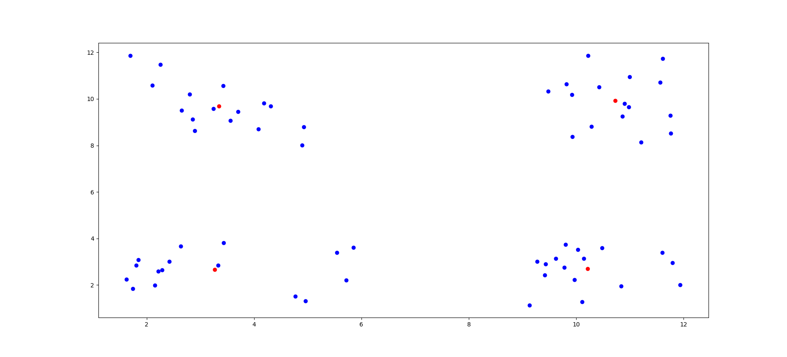
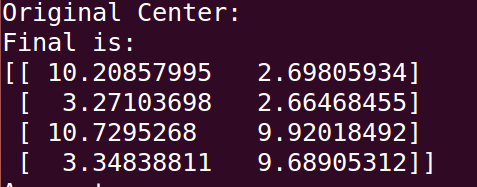

# Cluster
## INTRODUCDTION
聚类是一种无监督学习，他讲相似的对象归类到同一个簇中。与分类的最大不同是，分类事先已经已知目标，而聚类的类别事先是没有定义的。本节我们将实现K-Means算法，  
这是一种可将数据集分为k类的聚类算法。
## ACTION
### NORMAL
首先我们进行最传统的算法实现，该算法的基本流程如下：  
1.创建k个质心作为起点（随机选择）  
2.对每个点进行簇分配，分配结束后，更新簇质心。  
3.当质心不再变化后，输出簇分配结果。  
核心实现如下：  
<pre><code>
def kMeans(dataset,k):
    pointnum = np.shape(dataset)[0]
    center = FindRandomCenter(dataset,k)
    ClusterChanged = True
    ClusterAssment = np.mat(np.zeros([pointnum,2]))
    while ClusterChanged:
        ClusterChanged = False
        for i in range(pointnum):
            minDist = None
            minIndex = None
            for j in range(k):
                dis = Distance(center[j],dataset[i])
                if(minDist == minIndex == None):
                    minDist = dis
                    minIndex = j
                else:
                    if(minDist > dis):
                        minDist = dis
                        minIndex = j
            if(ClusterAssment[i,0] != minIndex):
                ClusterChanged = True
                ClusterAssment[i,:] = minIndex,minDist**2
               
        print center
        for cent in range(k):
            temp = dataset[np.nonzero(ClusterAssment[:,0].A == cent)[0]]
            center[cent] = np.mean(temp,axis=0)
    
    return center,ClusterAssment
</code></pre>  

图1 聚类结果
  
我们看到算法在几次迭代后收敛，成功地进行了聚类，其中红色点为聚类最终质心。  

图2 质心坐标

