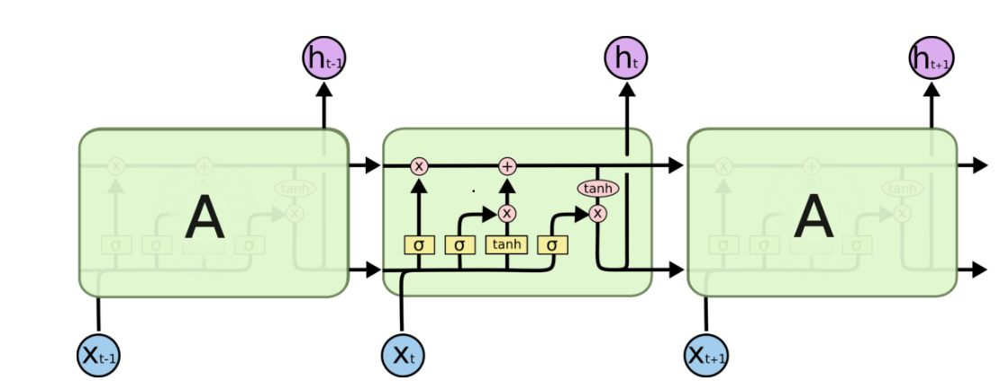

# Long-Short Term Memory Cell
## KNOWLEDGE
### Basic
LSTM网络实际上是一种模仿生物神经元记忆功能的深度神经网络，其原理如下图所示：

图1 LSTM Cell结构

其中，每个lstm单元都有两个输出，上面的是记忆，下面的是单元在t时刻的输出。  

#### Forget Gate
左边第一个即为遗忘门，它将t-1时刻的单元输出和t时刻的输入合并后，经过一个sigmoid变换，直接对t-1时刻的记忆进行作用。
#### Input Gate
左边第二个即为输入门，它将t时刻输入与t-1时刻输出合并后，经过sigmoid变换，再配合左边第三个网络层变换tanh，以一定比例对  
记忆产生作用。
#### Output Gate
第四个即为输出门，每一个时刻的输出，既依赖于当前时刻的输入，也依赖于历史记忆。所以输出门将t-1时刻lstm单元的输出、t时刻的输入以及
记忆相叠加后，得到t时刻的lstm单元的输出。
  
 

