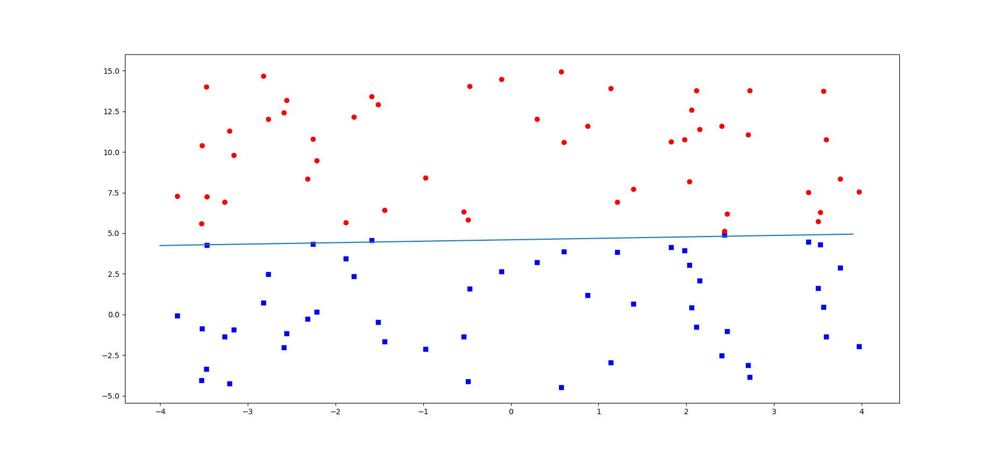

# Logic Regression
## Introduction
逻辑回归的重要思想是根据现有的数据对分类边界建立回归公式，从而进行分类。待分类数据由特征组成，逻辑回归乘以一个回归系数后，带入激活函数进行得到结果，
从而得到一个介于0-1之间的数，[0.5,1]为1，[0,0.5)为0。故实际上逻辑回归是一种概率估计。
## 基于Sigmoid函数的分类
<pre><code>
import numpy as np
import matplotlib.pyplot as plt

def loadDataset():
    f = open("./Dataset.txt")
    dataMat = []
    labelMat = []
    for line in f.readlines():
        lineData = (line.strip().split())
        dataMat.append([1.0, float(lineData[0]), float(lineData[1])])
        labelMat.append(int(lineData[2]))
    return dataMat, labelMat

def sigmoid(x):
    return 1.0 / (1 + np.exp(-x))

def grandAscent(dataMat, labels):
    dataMatrix = np.mat(dataMat)
    labelMat = np.mat(labels).transpose()
    m,n = np.shape(dataMatrix)
    alpha = 0.001
    iterations = 500
    weights = np.ones([n,1])
    for k in range(iterations):
        h = sigmoid(dataMatrix * weights)
        error = labelMat - h
        weights = weights + alpha * dataMatrix.transpose() * error
    return weights

def plotFig(weights, dataset, labels):
    type1x = []
    type1y = []
    type2x = []
    type2y = []
    for i in range(len(dataset)):
        if(labels[i] == 1):
            type1x.append(dataset[i][1])
            type1y.append(dataset[i][2])
        else:
            type2x.append(dataset[i][1])
            type2y.append(dataset[i][2])
    weights = np.asarray(weights)    
    x = np.arange(-4.0, 4.0, 0.1)
    y = (-weights[0] - weights[1]*x) / weights[2]
    fig = plt.figure()
    ax = fig.add_subplot(111)
    ax.plot(x, y)
    ax.scatter(type1x, type1y, color = 'b', marker = 's')
    ax.scatter(type2x, type2y, color = 'r')
    plt.show()

if __name__ == "__main__":
    dataMat,labelMat = loadDataset()
    weights = grandAscent(dataMat, labelMat)
    plotFig(weights, dataMat, labelMat)
</code></pre>  

图1 分类结果

